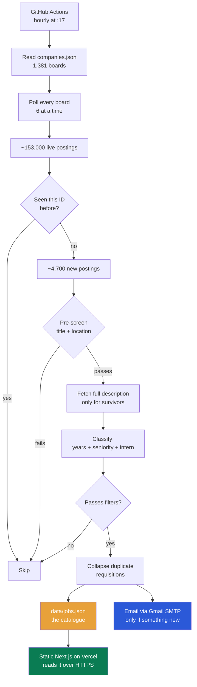
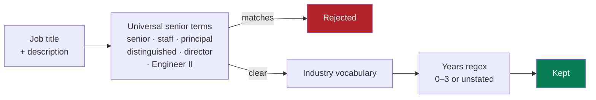
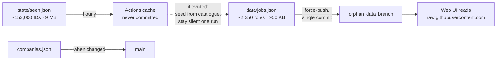
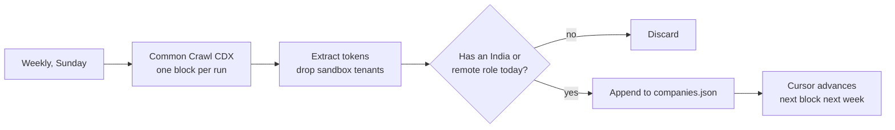

# How this works

## Where it stands

| | |
|---|---|
| **Job boards polled** | **1,381** |
| **Companies with live matching roles** | **400+** |
| Boards with nothing matching right now | 183 |
| Live postings read each run | ~153,000 |
| Roles that survive filtering | **~2,350** |
| Time for a full run | ~11 minutes |
| Cost | ₹0 |

Boards by platform: Greenhouse 187 · Workday 57 · Ashby 20 · SmartRecruiters 13 ·
Lever 10 · Darwinbox 8 · Phenom 8 · Oracle 3 · TurboHire 3 · Rendered 5 ·
Amazon, Atlassian, Eightfold 1 each.

188 were added deliberately; 121 were found automatically by the weekly Common
Crawl sweep. The 183 boards with no current match are not dead weight — they're
companies whose next entry-level India posting will reach you within the hour.
The nine Darwinbox employers are all in that bucket today: their live openings are
business associates and brand managers, not entry-level engineering.

## The whole pipeline

## Stage by stage

### 1. Poll — no scraping involved

Almost every source is a **public JSON endpoint the company already publishes**
to power its own careers page — no HTML parsing and no proxies. Google, Meta, Uber, Vanguard
and DAZN are the exceptions, and get headless Chromium because they expose no API at all. Thirteen
adapters cover thirteen platforms; see [ADDING-COMPANIES.md](ADDING-COMPANIES.md).

Six boards are fetched concurrently — politeness, not a technical limit.

### 2. Diff by requisition ID, never by date

A job is new if `{ats}:{token}:{externalId}` isn't in the seen state.

Dates are unusable for this. Workday returns relative strings (`"Posted Today"`)
with no timestamp, and companies routinely bump dates when they repost. IDs are
stable; dates are not.

### 3. Pre-screen before enriching — the expensive ordering

Most platforms don't include the job description in their list response, so
reading it costs one extra HTTP request *per posting*. Doing that for all ~4,700
unseen postings takes over ten minutes.

So location and role-family are checked first, using only the title and location
already in hand. Roughly 4,700 drop to ~1,400 candidates, and only those get
enriched. **This single ordering decision is a 10x speedup for zero lost matches** —
the years check is the only filter that genuinely needs the description text.

### 4. Classify — per-industry, because titles don't mean the same thing

The same word means opposite things by sector:

- **"Associate"** — junior at JPMorgan, mid-senior at Stripe
- **"Analyst"** — entry-level in banking and consulting, mid-level in tech
- **"Engineer II"** — never entry level, anywhere

So each company carries an `industry` tag selecting which vocabulary applies,
with one shared list of terms that mean senior everywhere.

**A senior title is decisive.** Descriptions routinely quote a low year-range in
one bullet and a high one in another, so letting years override the title lets
"Sr. Business Analyst" through on a stray "2 years".

### 5. Collapse duplicate requisitions

Amazon posts one role under three IDs. It's one application, so identical
`company + title + location` collapses to a single entry — keeping the lowest
stated experience. Every original ID still goes into the seen state, so the
copies are suppressed permanently instead of re-alerting next hour.

### 6. Deliver

- **Email** fires only when something new matched. First 25 as full cards, the
  rest as compact one-liners — truncating would lose them forever, since they're
  already marked seen.
- **`data/jobs.json`** is the catalogue: every open match plus recently closed
  ones, each with `firstSeen` / `lastSeen` / `closedAt`.
- **The web UI** fetches that file from GitHub at runtime, so new jobs appear
  without a redeploy.

### 7. Closure detection, free

A posting that disappears from a board that answered normally is marked
`closedAt`. Boards that *errored* are skipped — otherwise one flaky response
would mark a company's entire listing as closed.

This is the same "ghost job" protection commercial apps advertise, and it costs
nothing extra because the board is already being polled.

## State without a database

Git stores a **full copy** of a file per commit, not a delta, so at this scale
naive persistence is ruinous — the catalogue alone would add tens of gigabytes a
year. Three rules keep it flat:

1. **The seen state is never committed.** ~153,000 IDs is ~9 MB. It lives in the
   Actions cache. If that is ever evicted the run seeds itself from the committed
   catalogue and suppresses email for one cycle, rather than re-alerting every
   open role at once.
2. **The catalogue carries no descriptions.** `CatalogEntry` deliberately does
   *not* extend `Job`, because `Job.text` holds up to 6 KB of job description per
   row — that alone was 4.3 MB of the file. Nothing downstream reads it: the
   years are already extracted into `minYears`.
3. **The catalogue lives on an orphan branch.** It is derived data, regenerable
   from the boards at any time, so its history is worthless. The workflow
   force-pushes it to a `data` branch as a single commit every run, so that
   branch never accumulates history. Only `companies.json` — which is curated —
   keeps real history on `main`.

Those commits also keep the repository active, which stops GitHub disabling the
schedule after 60 days.

## Growing on its own

CDX pages by **block**, and passing `limit` alongside `page` silently returns an
empty page — so without a cursor every run would rescan the same `0x…2k` slice
forever and never find anything new. The cursor walks blocks and wraps at the end.

The India/remote gate is what keeps this useful: without it the sweep would add
thousands of companies that can never produce a single alert.

## Schedule

| When | What |
|---|---|
| Hourly at **:17** | Poll all boards, email new matches, publish the catalogue |
| Daily at **05:00 UTC** | Snapshot the seen state to git |
| Sunday **04:40 UTC** | Common Crawl sweep for new boards |

`:17` rather than `:00` because GitHub's scheduler queue is most congested at the
top of the hour.
