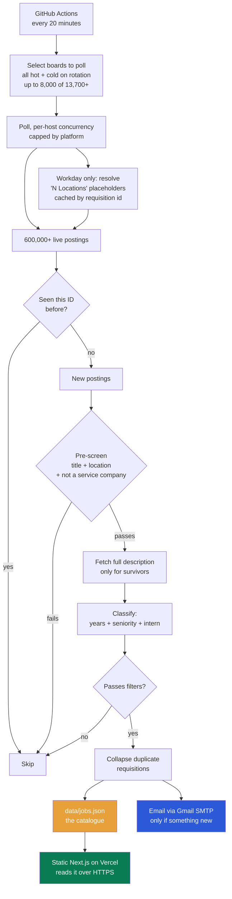
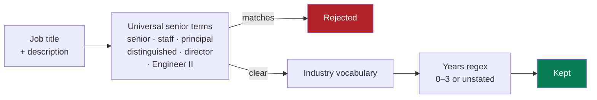
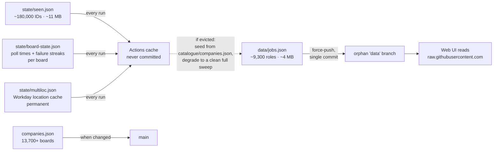
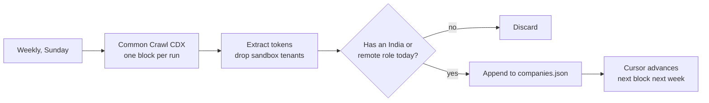

# How this works

## Where it stands

| | |
|---|---|
| **Job boards tracked** | **13,700+** |
| **Boards polled per run** | up to **8,000** (`BOARDS_PER_RUN`) |
| **Hot boards** (ever shown an India role — polled every run, no exceptions) | ~4,200 |
| **Cold boards** (never shown one yet — swept on rotation) | ~9,500 |
| Live postings read in a full run | 600,000+ |
| Roles that survive filtering | varies by run, low hundreds typically |
| Time for a full run at the current ceiling | ~26 minutes (measured; re-measure before raising `BOARDS_PER_RUN` again) |
| Cost | ₹0 |

Boards by platform (of 13,700+): Greenhouse ~4,960 · Ashby ~2,900 · Lever ~1,900 ·
SmartRecruiters ~1,400 · Workday ~1,700 · Oracle ~500 · Workable ~130 ·
Darwinbox ~40 · Recruitee ~40, plus SuccessFactors, Trakstar, PeopleStrong,
GreytHR, Zappyhire, Freshteam, Keka, Pyjamahr, TurboHire, Eightfold, Phenom,
iCIMS, Zoho Recruit, Recruiterflow, Zimyo and the rendered-DOM sites (Google,
Meta, Uber, Vanguard, DAZN) in smaller numbers. This grows constantly — a
weekly Common Crawl sweep, bulk imports from published tenant lists, and
manual additions all feed it — so treat any exact count here as a snapshot,
not a promise; `node -e "console.log(require('./companies.json').length)"`
gives the live number.

The corpus is designed to hold far more boards than any single run can poll:
cold rotation means a board with nothing to alert on today is not dead
weight, it's a company whose next entry-level India posting will reach you
within the hour it appears, on whichever run's rotation reaches it.

## The whole pipeline

## Stage by stage

### 1. Poll — no scraping involved

Almost every source is a **public JSON endpoint the company already publishes**
to power its own careers page — no HTML parsing and no proxies. Google, Meta,
Uber, Vanguard and DAZN are the exceptions, and get headless Chromium because
they expose no API at all. 25+ adapters cover 25+ platforms, including a set
of India-specific ATS adapters (Keka, Freshteam, Recruiterflow, GreytHR,
PeopleStrong, PyjamaHR, ZappyHire, Zimyo, Darwinbox, TurboHire) that nobody
else in this space has; see [ADDING-COMPANIES.md](ADDING-COMPANIES.md).

Concurrency is per rate-limit domain, not one global number
(`HOST_CONCURRENCY` in `config.ts`) — a whole Workday pod can host 90+ boards
that all share one throttling budget, while Greenhouse's shared CDN-backed API
tolerates far more parallel requests. This is politeness, not a technical
limit, sized after a real 429 incident on one Workday pod.

Workday additionally resolves any posting whose location is a bare placeholder
("6 Locations") to the real place list — the list view only ever shows a
count for multi-office postings, so a Bangalore role posted alongside five
other offices would otherwise be invisible to the India match below.
Resolved once per requisition id and cached permanently
(`state/multiloc.json`), capped per board per run so a single large employer
can't dominate its shared concurrency slot.

### 2. Diff by requisition ID, never by date

A job is new **to the tracker** if `{ats}:{token}:{externalId}` isn't in the
seen state.

Dates can't drive this: companies routinely bump a posting's timestamp when
they repost the same requisition, so a date-based diff would treat every
repost as brand-new. IDs are stable; dates are not. Dates *are* parsed now
(Workday's relative strings like `"Posted 5 Days Ago"` included) — but only to
decide **freshness** for the email's urgent-vs-backlog split (§6), a separate
question from whether a posting has been seen before at all. A date moving
forward on an already-seen id is itself a signal, surfaced in the web UI as a
"date bumped" badge — an employer re-stamping a stale requisition to look new.

### 3. Pre-screen before enriching — the expensive ordering

Most platforms don't include the job description in their list response, so
reading it costs one extra HTTP request *per posting*. Doing that for every
previously-unseen posting in a full run (a real run has seen 600,000+ live
postings, of which a few thousand are new to the tracker on any given pass)
would be enormous for no benefit — most never had a chance of matching.

So location, role-family, and the service-company exclusion are checked
first, using only the title and location already in hand — roughly 95% of
postings are screened out here in a typical run. Only survivors get their
description fetched and enriched. **This single ordering decision is what
makes a five-figure board count survivable at all** — the years check is the
only filter that genuinely needs the description text.

### 4. Classify — per-industry, because titles don't mean the same thing

The same word means opposite things by sector:

- **"Associate"** — junior at JPMorgan, mid-senior at Stripe
- **"Analyst"** — entry-level in banking and consulting, mid-level in tech
- **"Engineer II"** — never entry level, anywhere

So each company carries an `industry` tag selecting which vocabulary applies,
with one shared list of terms that mean senior everywhere.

**A senior title is decisive.** Descriptions routinely quote a low year-range in
one bullet and a high one in another, so letting years override the title lets
"Sr. Business Analyst" through on a stray "2 years".

### 5. Collapse duplicate requisitions

Amazon posts one role under three IDs. It's one application, so identical
`company + title + location` collapses to a single entry — keeping the lowest
stated experience. Every original ID still goes into the seen state, so the
copies are suppressed permanently instead of re-alerting next hour.

### 6. Deliver

- **Email** fires only when something new matched. First 25 as full cards, the
  rest as compact one-liners — truncating would lose them forever, since they're
  already marked seen.
- **`data/jobs.json`** is the catalogue: every open match plus recently closed
  ones, each with `firstSeen` / `lastSeen` / `closedAt`.
- **The web UI** fetches that file from GitHub at runtime, so new jobs appear
  without a redeploy.

### 7. Closure detection, free

A posting that disappears from a board that answered normally is marked
`closedAt`. Boards that *errored* are skipped — otherwise one flaky response
would mark a company's entire listing as closed.

This is the same "ghost job" protection commercial apps advertise, and it costs
nothing extra because the board is already being polled.

## State without a database

Git stores a **full copy** of a file per commit, not a delta, so at this scale
naive persistence is ruinous — the catalogue alone would add tens of gigabytes a
year. The rules that keep it flat:

1. **Nothing volatile is committed.** `seen.json`, `board-state.json` (per-board
   poll times and failure streaks — this used to live on the `Company` row
   itself, and rewrote up to `BOARDS_PER_RUN` lines of `companies.json` every
   run before it was split out), `multiloc.json`, `outage.json`,
   `host-stats.json`, `reposts.json` and `board-volumes.json` all live in the
   Actions cache only. If any is ever evicted, the loss is bounded and
   specific — a fresh `seen.json` re-seeds from the committed catalogue and
   suppresses email for one cycle; an empty `board-state.json` makes every
   board read as never-polled, which the rotation logic already sorts first
   (a clean full sweep, not a stall); an empty `multiloc.json` just means
   Workday placeholder locations get re-resolved from scratch, capped the same
   way a first backfill is.
2. **The catalogue carries no descriptions.** `CatalogEntry` deliberately does
   *not* extend `Job`, because `Job.text` holds several KB of job description
   per row. Nothing downstream reads it: the years are already extracted into
   `minYears`.
3. **The catalogue lives on an orphan branch.** It is derived data, regenerable
   from the boards at any time, so its history is worthless. The workflow
   force-pushes it to a `data` branch as a single commit every run, so that
   branch never accumulates history. Only `companies.json` — which is curated,
   and now changes only when a board is added, dropped, or first goes hot,
   not on every poll — keeps real history on `main`.

Those commits also keep the repository active, which stops GitHub disabling the
schedule after 60 days.

## Growing on its own

CDX pages by **block**, and passing `limit` alongside `page` silently returns an
empty page — so without a cursor every run would rescan the same `0x…2k` slice
forever and never find anything new. The cursor walks blocks and wraps at the end.

The India/remote gate is what keeps this useful: without it the sweep would add
thousands of companies that can never produce a single alert.

**Not automatic**: `npm run bulk-import` (manually triggered), which validates
candidates from published tenant lists other open-source crawlers have already
compiled — the same India/remote gate applies, plus a check against
`SERVICE_COMPANIES` and against the actual job titles returned, not just
whether a slug resolves. `--rediscover` walks existing Workday tenants for
career sites not yet tracked (a tenant can host several — CIBC's `search` and
`campus` are separate, non-overlapping boards). See
[ADDING-COMPANIES.md](ADDING-COMPANIES.md) for the full flag reference.

## Schedule

| When | What |
|---|---|
| Every **20 minutes** | Poll up to `BOARDS_PER_RUN` boards, email new matches, publish the catalogue |
| **05:25 and 17:25 UTC** | `discover-news` — sweep startup-funding headlines for newly-funded companies |
| Sunday **04:40 UTC** | Common Crawl sweep for new boards |
| Hourly at **:30** | `outreach` — cold-outreach draft batch (separate feature, see `OUTREACH-DESIGN.md`) |

20-minute polling (not hourly) exists specifically to tolerate GitHub's flaky
scheduler — a run that takes longer than 20 minutes queues behind the next
trigger rather than overlapping it, so the real target is ~1 hour data
freshness, not literal 20-minute delivery. None of the state files above are
ever committed to git on a schedule; they live in the Actions cache and are
restored/saved every run, evicting on GitHub's own cache-retention policy
rather than a schedule this project controls.
